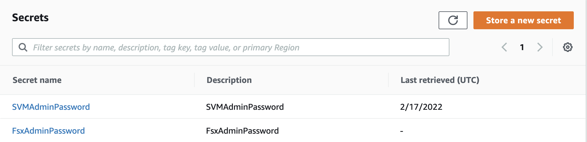
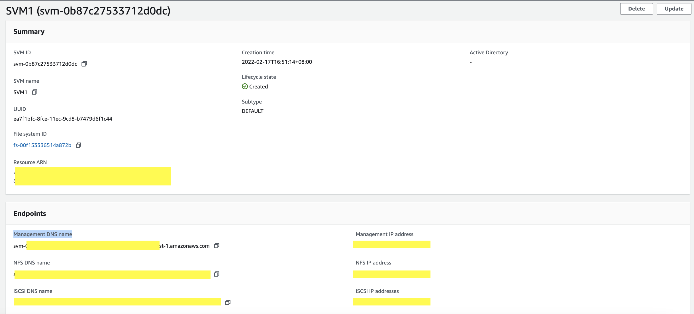
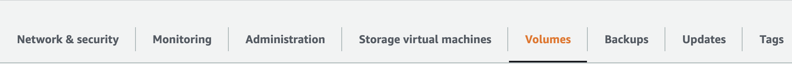
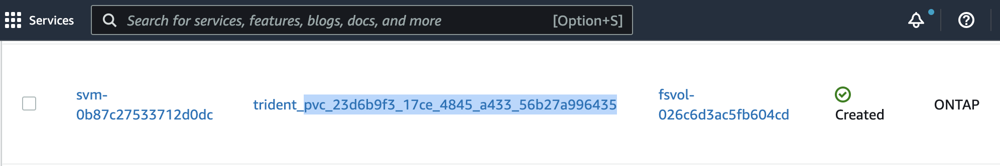

# Provision Trident Volumes and Storage Class

## (1) Create Kubernetes Secret to store the SVM username and password

Create this file and key in the SVM username and Admin password, and save it as `svm_secret.yaml`.  

**Note**
: the SVM username and its admin password has been created via Step 3. Create an Amazon FSx for NetApp ONTAP file system, if you do not recall, you can retrieve it from the AWS Secrets Manager.



```bash
# Create the a k8s secret that stores the svm password of FSxONTAP file system
$ vi svm_secrets.yaml

apiVersion: v1
kind: Secret
metadata:
  name: backend-fsx-ontap-nas-secret
  namespace: trident
type: Opaque
stringData:
  username: vsadmin
  password: <SVMPassword> 

$ kubectl apply -f svm_secret.yaml
secret/backend-fsx-ontap-nas-secret created

$ kubectl get secrets -n trident |grep backend-fsx-ontap-nas
backend-fsx-ontap-nas-secret      Opaque                                2      30s
```

## (2) Create the Trident Backend

When configuring the backend configuration for Trident, there are five drivers for ONTAP backends as shown in the following table, differentiated by the protocol being used and how the volumes are provisioned on the storage system. Refer to the [Trident documentation](https://netapp-trident.readthedocs.io/en/latest/dag/kubernetes/integrating_trident.html) for more details when considering which one to use based on your application.

| Driver      | Description | Compatible with FSxONTAP? |
| :-----------: | ----------- | :--------:|
| ontap-san   | Each PV provisioned is a LUN within its own FlexVolume.       | Yes |
| ontap-san-economy   | Each PV provisioned is a LUN, with a configurable number of LUNs per FlexVolume (default is 100)        | Yes |
| ontap-nas	| Each PV provisioned is a full ONTAP FlexVolume|	Yes	|
| ontap-nas-economy | Each PV provisioned is a qtree, with a configurable number of qtrees per FlexVolume (default is 200) |Yes	|
| ontap-nas-flexgroup | Each PV provisioned as a full ONTAP FlexGroup, and all aggregates assigned to a SVM are used | Yes|
			
Here in this blog post, we will choose the `ontap-nas` driver that supports multi-attach, meaning the volume provisioned could be mounted by multiple pods simultaneously; and this allows the volume to be re-mounted by rescheduled pod of a StatefulSet due to a network partition, worker node failure or unexpected node draining in the K8S data plane. Go back to your cloned folder, and change directory to the eks folder, you will see backend-ontap-nas.yaml file. Replace the managementLIF and dataLIF with the correct details, and save the file.

**Note**: ManagementLIF can be found via the Amazon FSx Console as shown in the below highlighted as “Management DNS name”.



Below is an explanation on relevant backend configuration parameters: 

| Parameter      | Description | Remarks |
| :-----------: | :-----------: | -------|
| backendName	|Cusotm name for the storage backend||
| managementLIF	|IP address or FQDN of a cluster or SVM management LIF ||
|dataLIF	    |IP address of protocol LIF	|When choosing ontap-san driver for backend, dataLIF could be skipped|
|SVM	        |Storage virutal machine to use||
	
```yaml	
apiVersion: trident.netapp.io/v1
kind: TridentBackendConfig
metadata:
 name: backend-fsx-ontap-nas
 namespace: trident
spec:
 version: 1
 backendName: fsx-ontap-nas
 storageDriverName: ontap-nas
 managementLIF: <managementLIF> #Fill in your management DNS name for your SVM
 svm: SVM1
 credentials: # this is link to the secret created in the above step.
 name: backend-fsx-ontap-nas-secret
```

Make sure that the status of the Trident backend configuration deployed is “Success”.

```bash
$ cd eks
$ kubectl apply -f backend-ontap-nas.yaml
tridentbackendconfig.trident.netapp.io/backend-fsx-ontap-nas created

$ kubectl get tbc -n trident
NAME                   BACKEND NAME  BACKEND UUID                          PHASE  STATUS
backend-fsx-ontap-nas  fsx-ontap     6329459a-55e9-4606-881d-f83e34f558db  Bound  Success
```

## (3) Create Storage Class

The storage class yaml manifest is located as `storage-class-csi-nas.yaml`

```yaml
apiVersion: storage.k8s.io/v1
kind: StorageClass
metadata:
  name: trident-csi
provisioner: csi.trident.netapp.io
parameters:
  backendType: "ontap-nas"
allowVolumeExpansion: True
reclaimPolicy: Retain
```
```bash
$ kubectl apply -f storage-class-csi-san.yaml
storageclass.storage.k8s.io/trident-csi create

# Check the status of the storage class
$ kubectl get sc
NAME            PROVISIONER             RECLAIMPOLICY   VOLUMEBINDINGMODE      ALLOWVOLUMEEXPANSION   AGE
trident-csi     csi.trident.netapp.io   Retain          Immediate              true                   42s
```

## (4) Create Persistent Volume Claim

The persistent volume claim manifest is located as `pvc-trident.yaml`.

```yaml
kind: PersistentVolumeClaim
apiVersion: v1
metadata:
  name: basic
spec:
  accessModes:
    - ReadWriteMany
  resources:
    requests:
      storage: 10Gi
  storageClassName: trident-csi
```

Verify that the persistent volume is created successfully and the PersistentClaim status is “Bound”

```bash
$ kubectl create -f pvc-trident.yaml
persistentvolumeclaim/basic created

#Check the status of the persistent volume created
$ kubectl get pv

NAME                                     CAPACITY  ACCESS MODES   RECLAIM POLICY  STATUS    CLAIM      STORAGECLASS  REASON  AGE
pvc-23d6b9f3-17ce-4845-a433-56b27a996435  10Gi    RWX             Retain          Bound default/basic  trident-csi           25s
```

And when you navigate back to FSxONTAP console, select “Volumes” of your file system, then you can see the corresponding volume has been created:



Now we have finished configuring the trident operator and verify that it enables us to provision Kubernetes Persistent Volume Claim successfully. In the next section, we will deploy a stateful application that runs on Amazon EKS and have the PersistentVolume provisioned by Trident. 
